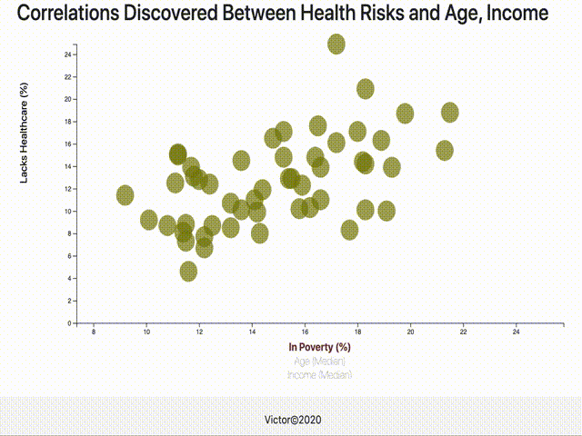

# Health_Risks_D3.js

## Summary:
Created a dynamic web visualization analyzing the current trends shaping people’s lives using data from the US Census Bureau. Responsible for developing code for visualization utilizing D3 techniques.

The data set included with the assignment is based on 2014 ACS 1-year estimates from the [US Census Bureau](https://data.census.gov/cedsci/). The current data set includes data on rates of income, obesity, poverty, etc. by state. MOE stands for "margin of error."

### Demo:

